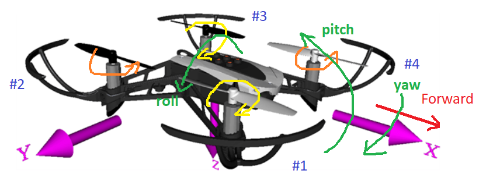
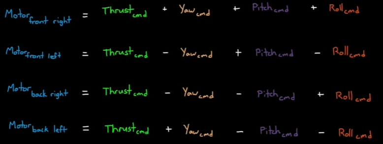
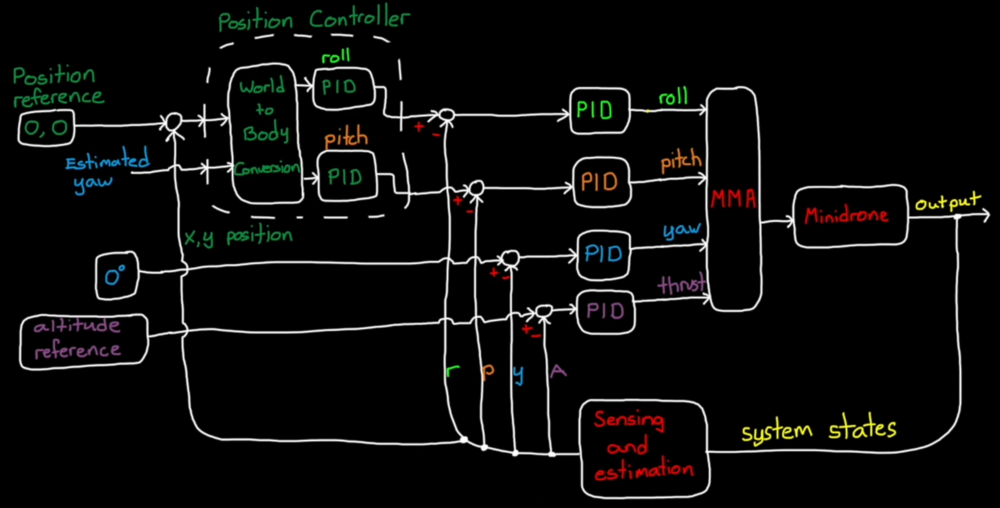

# Coordinate system

Rotors are labeled by #1 - #4.
The coordinate system is fixed to the COM of the vehicle and follows right-hand rule.

# Motor mixing alogrithm (MMA)

The system is underactuated because it has 4 motors for 6 degrees of freedom.

- Moving forward/backward and left/right are unactuated motion. This is achieved by combining thrust with pitch/roll by rotating the thrust vector.
- Thrust, roll, pitch and yaw can be controlled independently.

# Sensors
## Ultrasound
An ultrasound sensor at the bottom of the vehicle measures the height from the ground using high frequency pulses of sound.

## Camera
A camera at the bottom of the vehicle provides an optical flow for measuring horizontal motion and speed.

## Pressure
A pressure sensor measures the altitude.

## IMU
An inertial measurement unit measures the motion (linear acceleration and angular rate) in 6 degrees of freedom (6-DOF).

# Hovering controller architecture

Image source: [Drone Simulation and Control](https://uk.mathworks.com/videos/series/drone-simulation-and-control.html)