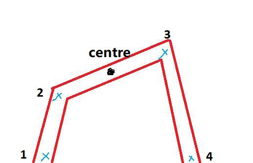
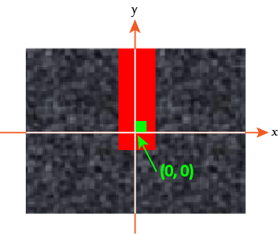

# Introduction

This documentation describes the data format being transmitted into/out of the Flight Control System.

| Input port | Name       |
| ---------- | ---------- |
| #1         | AC cmd     |
| #2         | Sensors    |
| #3         | Image data |

| Output port | Name      |
| ----------- | --------- |
| #1          | Actuators |
| #2          | Flag      |

# In #1/Out #1: Motor commands

This is also called `ReferenceValueServerCmds` in the Control subsystem and `UpdatedReferenceCmds` at the output of the Path Planning module.

`ReferenceValueServerCmds` is a structure that contains the following fields:

| Name                     | Data type | Description                                                  |
| ------------------------ | --------- | ------------------------------------------------------------ |
| `takeoff_flag`           | bool      | Indicates if the minidrone take off stage is incomplete (0 for take off complete) |
| `live_time_ticks`        | int       | A timer that increments 20 ticks per second                  |
| `pos_ref`                | single    | An array of 3 coordinates [x y z] which corresponds to the target point |
| `orient_ref`             | single    | An array of 3 parameters [yaw pitch roll] which controls the orientation of the minidrone |
| `controlModePosVSOrient` | bool      | Indicates if the position or orientation is controller       |

This is summarised by a structure in C:

```c
typedef struct
{
    bool takeoff_flag; // Set to false for takeoff complete
    int live_time_ticks;
    float pos_ref[3]; // 0: x, 1: y, 2: z
    float orient_ref[3]; // 0: yaw, 1: pitch, 2: roll
    bool controlModePosVSOrient;
}
ReferenceValueServerCmds;
```

# In #2: Sensor data

This is passed to the State Estimator in the Control subsystem and converted to `EstimatedVal`, which is then passed into the Path Planning module.

The estimated values are the current position and orientation of the minidrone based on sensor data. Signals on the `EstimatedVal` bus are structures which have the following fields:

| Name    | Data type | Description                                                  |
| ------- | --------- | ------------------------------------------------------------ |
| `x`     | single    | The x-coordinate (metres) of the minidrone relative to the take off position |
| `y`     | single    | The y-coordinate (metres) of the minidrone relative to the take off position |
| `z`     | single    | The z-coordinate (metres) of the minidrone relative to the take off position |
| `yaw`   | single    | The amount of yaw of the minidrone                           |
| `pitch` | single    | The amount of pitch of the minidrone                         |
| `roll`  | single    | The amount of roll of the minidrone                          |

# In #3: Image data/Vision based data

The Y1UY2V encoding is converted into RGB encoding in the Image Processing subsystem, in which *vision based data* is calculated.

The current design needs the *vision based data* to be an array of `breakpoint`, which is a structure containing the **x- and y-coordinates** of a pixel on the image and an `int` which represents the **type** of a breakpoint.

The order of `breakpoint`s in the array should be consistent with the segments in the camera view, i.e. part of the track that is visible to the camera can be recreated by following the order of breakpoints.



The order could be reversed (either 1-2-3-4 or 4-3-2-1) and the Control subsystem will be able to determine if the minidrone should go to breakpoint 2 or 3 based on current direction.

## Data structure

The data type looks like this in C:

```c
typedef struct
{
    float x;
    float y;
    int type;
}
breakpoint;
```

The `type` field should take one of the following values only:

| `type` | Value                                                        |
| ------ | ------------------------------------------------------------ |
|-1      | This element is not used in the array.                       |
| 0      | The point is an intersection of two segments of the track.   |
| 1      | The point is on the edge of the camera view.                 |
| 2      | The point is the end of track, i.e. the starting point or the end of track. |
| 3      | This the centre of the circular landing zone.                |

## Coordinate system

The x- and y-coordinates are in the coordinate system defined as below:


